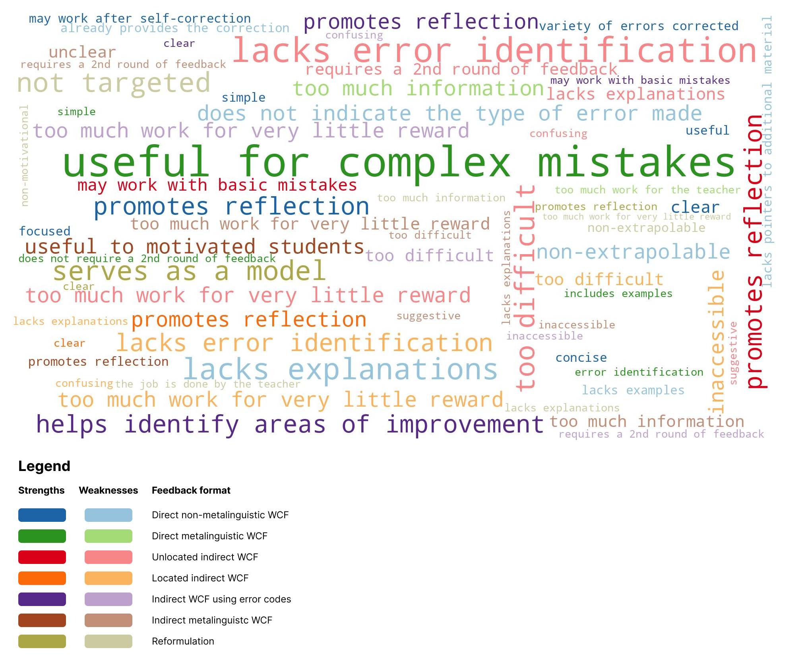

```{r setup, include=FALSE}
knitr::opts_chunk$set(echo = TRUE)
```
<br>
Hello, reader! Thank you for your interest in this work.

Let me guide you through the steps taken to conduct the statistical analyses reported on our paper.

## Preparation

**Loading libraries**

Here are the libraries that we are going to employ. If you have not already, remember to install them via `install.packages()` first.:

```{r load libraries, message=FALSE}
library(tidyverse)
library(areaplot)
library(ggthemes)
library(RColorBrewer)
library(likert)
library(maps)
```

**Loading data set**

Next, we are going to load the data sets obtained after computing the measures needed for our model with Python.

```{r load files, message=FALSE}
# ==== QUESTIONNAIRE RESPONSES ====
participant_responses <- read_csv('Data/participant_responses.csv')
```

**Cleaning data set**

```{r clean data sets, message=FALSE}
# Rename columns
participant_responses <- participant_responses %>%
  rename(region = country)

# Extract relevant columns
fb_opinions_usefulness <- participant_responses %>%
  dplyr::select(fb_1_usefulness,
         fb_2_usefulness,
         fb_3_usefulness,
         fb_4_usefulness,
         fb_5_usefulness,
         fb_6_usefulness,
         fb_7_usefulness)

test_scores <- c(5.8, 7.21, 7.42, 8.75, 6.67, 5.85, 8.09, 6.84, 8.25, 7.75,
                 6.01, 6.73, 8.58, 7.06, 5.85, 8.5, 6.31, 6.34, 7.62, 7.12, 5.79)
participant_responses$test_scores <- test_scores
```

**Data visualization**

```{r map visualization, echo=FALSE, fig.width=12, fig.height=4, fig.align='default'}
# ==== Participant characteristics ====
mapdata <- map_data("world")
mapdata <- mapdata %>%
  filter(!(region %in% c(
    "Aruba", "Afghanistan", "Angola", "Anguilla", "United Arab Emirates", "Argentina", "Armenia", "American Samoa", "Antarctica", "Australia", "French Southern and Antarctic Lands", "Antigua", "Barbuda", "Azerbaijan", "Burundi", "Benin", "Burkina Faso", "Bangladesh", "Bahrain", "Saint Barthelemy", "Bermuda", "Bolivia", "Brazil", "Barbados", "Brunei", "Bhutan", "Botswana", "Central African Republic", "Chile", "Ivory Coast", "Cameroon", "Democratic Republic of the Congo", "Republic of Congo", "Cook Islands", "Colombia", "Comoros", "Cape Verde", "Curacao", "Djibouti", "Dominica", "Algeria", "Ecuador", "Egypt", "Eritrea", "Canary Islands", "Ethiopia", "Fiji", "Falkland Islands", "Reunion", "Mayotte", "French Guiana", "Martinique", "Guadeloupe", "Micronesia", "Gabon", "Georgia", "Ghana", "Guinea", "Gambia", "Guinea-Bissau", "Equatorial Guinea", "Grenada", "Guam", "Guyana", "Heard Island", "Indonesia", "India", "Cocos Islands", "Christmas Island", "Chagos Archipelago", "Iran", "Iraq", "Israel", "Jordan", "Siachen Glacier", "Kenya", "Kyrgyzstan", "Cambodia", "Kiribati", "Nevis", "Saint Kitts", "Kuwait", "Laos", "Lebanon", "Liberia", "Libya", "Saint Lucia", "Sri Lanka", "Lesotho", "Saint Martin", "Morocco", "Madagascar", "Maldives", "Marshall Islands", "Mali", "Myanmar", "Northern Mariana Islands", "Mozambique", "Mauritania", "Montserrat", "Mauritius", "Malawi", "Malaysia", "Namibia", "New Caledonia", "Niger", "Norfolk Island", "Nigeria", "Niue", "Bonaire", "Sint Eustatius", "Saba", "Nepal", "Nauru", "New Zealand", "Oman", "Pakistan", "Panama", "Pitcairn Islands", "Peru", "Philippines", "Palau", "Papua New Guinea", "Madeira Islands", "Azores", "Paraguay", "Palestine", "French Polynesia", "Qatar", "Rwanda", "Western Sahara", "Saudi Arabia", "Sudan", "South Sudan", "Senegal", "Singapore", "South Sandwich Islands", "South Georgia", "Saint Helena", "Ascension Island", "Solomon Islands", "Sierra Leone", "Somalia", "Sao Tome and Principe", "Suriname", "Swaziland", "Sint Maarten", "Seychelles", "Syria", "Chad", "Togo", "Thailand", "Tajikistan", "Turkmenistan", "Timor-Leste", "Tonga", "Trinidad", "Tobago", "Tunisia", "Turkey", "Taiwan", "Tanzania", "Uganda", "Uruguay", "Uzbekistan", "Grenadines", "Saint Vincent", "Venezuela", "Vietnam", "Vanuatu", "Wallis and Futuna", "Samoa", "Yemen", "South Africa", "Zambia", "Zimbabwe")))
mapdata <- left_join(mapdata, participant_responses, by="region", relationship = "many-to-many")

country_counts <- participant_responses %>%
  group_by(region) %>%
  summarize(participant_count = n())

mapdata <- left_join(mapdata, country_counts, by="region")

map1 <- ggplot(mapdata,
               aes(x = long, y = lat, group = group)) +
  geom_polygon(aes(fill = participant_count), color = "black", linewidth = 0.1) +
  coord_quickmap() +
  scale_fill_gradient(low = "#ffe5d9", high = "#ff595e", na.value="#f8f9fa", name = "") +
  labs(title = "Number of participants per country") +
  theme_void()

map1 + theme(legend.position = "bottom")
```

```{r data visualization, message=FALSE}

custom_palette <- c("#fff1e6", "#ffd7ba", "#eccaff", 
                    "#bdb2ff", "#ccd5ae", "#acd8aa",
                    "#fad2e1", "#c8c7d6", "#fcf6bd",
                    "#bee1e6", "#e2a0ff", "#d4a373",
                    "#d5bdaf", "#ffd972", "#faa381",
                    "#d17b88", "#fface4", "#b9fbc0",
                    "#75dbcd", "#a2d2ff", "#809bce")

custom_lik_palette <- c("#eaf4f4", "#cce3de", "#a4c3b2", "#6b9080")

# Graph depicting participants characteristics
# Graph depicting questionnaire results

# ==== Student Opinions on Feedback Usefulness ====
consistent_levels <- c("1", "2", "3", "4")

fb_opinions_usefulness <- as.data.frame(
  lapply(fb_opinions_usefulness,
         function(x) {
           factor(x, levels = consistent_levels)
         })
)

fb_opinions_usefulness <- fb_opinions_usefulness %>%
  rename(`Direct non-metalinguistic WCF` = fb_1_usefulness,
         `Direct metalinguistic WCF` = fb_2_usefulness,
         `Unlocated indirect WCF` = fb_3_usefulness,
         `Located indirect WCF` = fb_4_usefulness,
         `Indirect WCF using error codes` = fb_5_usefulness,
         `Indirect metalinguistic WCF` = fb_6_usefulness,
         `Reformulation` = fb_7_usefulness)

fb_opinions_usefulness_likert <- likert(
  fb_opinions_usefulness)

PlotOpinions <- plot(fb_opinions_usefulness_likert, text.size=3) +
  theme_classic() +
  theme(legend.position = "bottom") +
  labs(title = "Perceived usefulness of feedback formats (N=21)\n") +
  guides(fill = guide_legend(
    title = "1 = Not useful at all\n4 = Very useful")) +
  scale_fill_manual(values = custom_lik_palette)

PlotOpinions

```
<br>
<br>
**Student opinions on each feedback type**
<br>
<br>

```{r data visualization 2, echo=FALSE, message=FALSE}



```
